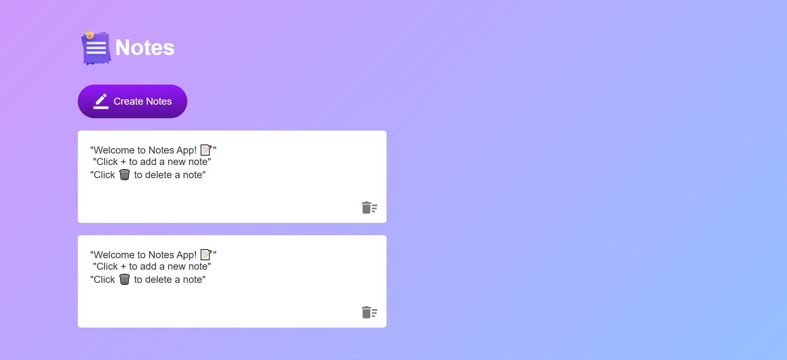

# Notes App 📝

A simple notes app built with vanilla JavaScript.
Create, edit, and delete sticky notes saved using localStorage.

---

## Features
- ➕ Add new notes
- ✏️ Edit notes in real-time
- 🗑️ Delete notes
- 💾 Saves notes using localStorage
- 🔄 Notes persist after page refresh

---

## Tech Used
- HTML
- CSS
- JavaScript (Vanilla)

---

## How to Run
1. Clone the repo
2. Open `index.html` in your browser

---

## Screenshot

---

## Live Demo
[Click Here](https://piyushdhakad001.github.io/js-notes-app/)

---

Made by **Piyush** 🚀